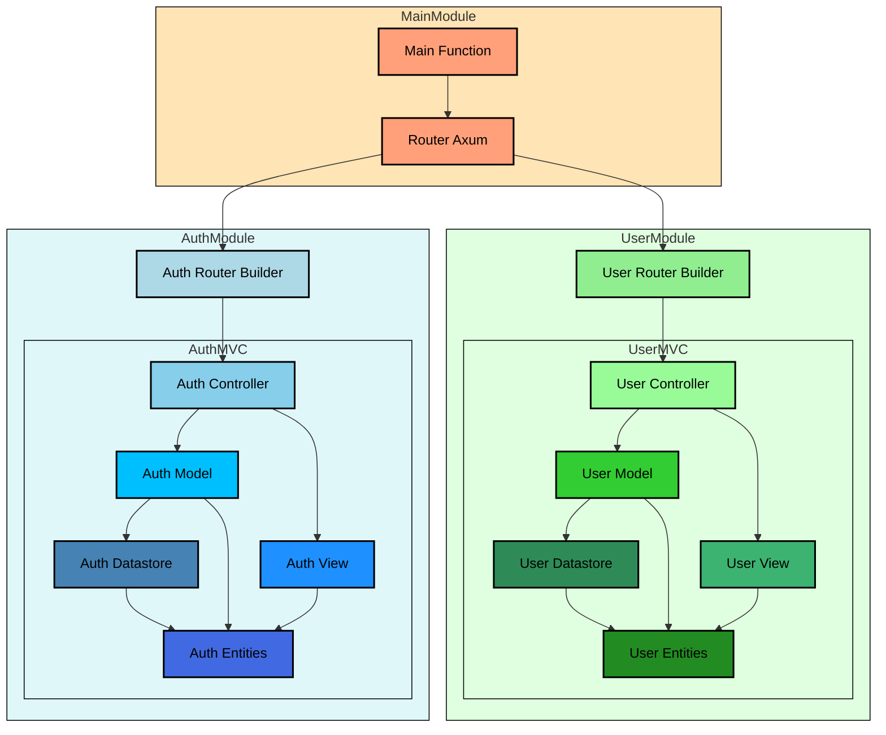
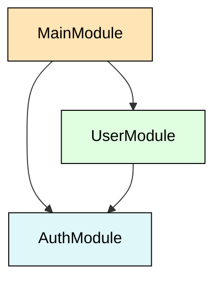

# general architecture

## Introduction

This API architecture is based on multiple components with fewer dependence possible.

The features detailed documentations will be in `docs/` folder. 

---

### Why Multiple Module-Based Architecture?

The goal is to create a relevant, easy-to-maintain, and resilient API architecture.

#### The Challenge with Monoliths

- **Initial Development**: When starting a project, a monolithic architecture is often the best choice to quickly deliver the first version.
- **Long-term Maintenance**: Over time, maintaining and updating a monolith becomes increasingly difficult.
- **Transition to Microservices**: Teams experienced with monoliths may decide to rewrite or refactor the project into microservices. This transition can be complex, costly, and often involves significant changes to the deployment process and infrastructure. Sometimes, the transition fails, and the team reverts to the monolith.

#### The Alternative: Multiple Module-Based Architecture

A multiple module-based architecture offers an ideal solution for evolving projects:

- **Single Deployment**: Easy to manage and cost-effective.
- **Scalability**: Initially, vertical scalability is sufficient. Modules can progressively be moved into separate microservices if needed.
- **Simplicity Over Microservices**: No network communication or controllers between services, reducing complexity.
- **Independent Codebase**: Keeps code fully independent and controls dependency flow.
- **Team Separation**: Teams can be more easily assigned to different modules.
- **No Shared Databases**: Modules do not share databases or collections. This isolation maintains code maintainability and facilitates module extraction into separate services.
- **Performance**: High performance due to the absence of network exchanges between modules. Unlike monoliths, there are no shortcuts that bypass module boundaries.
- **Easier Maintenance**: Each module is separated, allowing for individual dependency updates and preventing spaghetti code.
- **Technology Compatibility**: The base technology (e.g., Axum) is compatible, but minor dependencies can differ. This flexibility allows for step-by-step dependency replacements.
- **Module Replacement**: Modules can be replaced with other technologies if extracted into independent services.
- **Easier Testing**: Modules are easier to debug and maintain without network communication between them.

---

## Architecture comparaison

| Feature                | 	Monolith                       | 	Micro-Module                                | 	Microservice                                  |
|------------------------|---------------------------------|----------------------------------------------|------------------------------------------------|
| Definition             | 	Single unified codebase        | 	Decomposed into modules but within same app | 	Independent services communicating over APIs  |
| Deployment             | 	Single deployment unit         | 	Single deployment but modular internally    | 	Independent deployment per service            |
| Scalability            | 	Vertical scaling only          | 	Vertical scaling only*                      | 	Vertical + Horizontal scaling                 |
| Development Complexity | 	Simpler for small projects     | 	Moderate complexity                         | 	High complexity                               |
| Fault Isolation        | 	To define**                    | 	To define**                                 | 	To define**                                   |
| Code Management        | 	Centralized                    | 	Centralized or/and Decentralized            | 	Centralized or/and Decentralized              |
| Team Structure         | 	Single, centralized team       | 	Centralized or Modular teams                | 	Centralized or Modular teams                  |
| Data Management        | 	One database                   | 	Independent databases per module**          | 	Independent databases per service             |
| Performance            | 	Potentially better performance | 	Between Monolith and Microservice           | 	Overhead due to inter-service communication   |
| Maintenance            | 	Can become complex with size   | 	Easier to maintain due to isolation         | 	Easier to maintain due to isolation           |
| Technology Stack       | 	Homogeneous                    | 	Homogeneous or partially heterogeneous      | 	Heterogeneous                                 |
| Testing                | 	Easier to test end-to-end      | 	Easier than monolith                        | 	Complex, needs extensive testing              |
| Communication Overhead | 	Low                            | 	Low                                         | 	High                                          |
| Example Use Cases      | 	Small to medium applications   | 	Medium to large applications                | 	Large scale applications with complex domains |

## Architecture schema

## Dependencies module schéma

