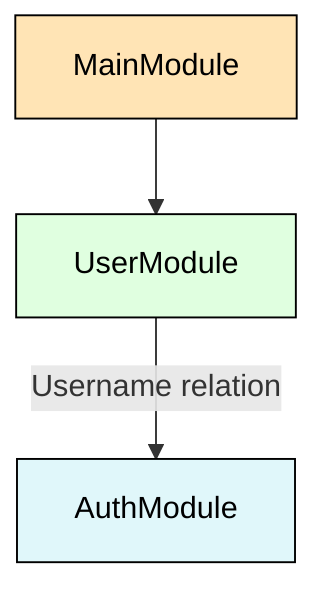

# Subscribe feature

- API redirect `/user/subscribe` on user module controller ONLY.
- This allows to create user profile and auth information on same time.

## Dependencies module schéma

```mermaid
graph TD

%% Modules
MainModule[MainModule]:::mainmodule
style MainModule fill:#FFE4B5,stroke:#000,stroke-width:1px,color: black;

AuthModule[AuthModule]:::authbuilder
style AuthModule fill:#E0F7FA,stroke:#000,stroke-width:1px,color: black;

UserModule[UserModule]:::userbuilder
style UserModule fill:#E0FFE0,stroke:#000,stroke-width:1px,color: black;


%% Connections
MainModule --> UserModule
UserModule --> |Username relation| AuthModule
```